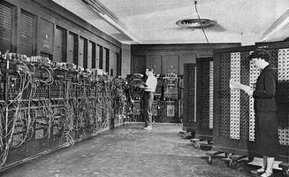
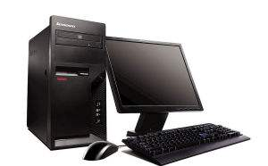
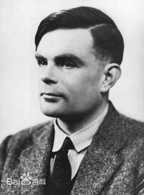

**我的第一次作业**  **名词解释**
# Computer 电子计算机
A computer is a device that can be instructed to carry out sequences of arithmetic or logical operations automatically via computer programming. Modern computers have the ability to follow generalized sets of operations, called programs. These programs enable computers to perform an extremely wide range of tasks.

电子计算机，亦称电脑，计算机是一种利用数字电子技术，根据一系列指令指示其自动执行任意算术或逻辑操作串行的设备。通用计算机因有能遵循被称为“程序”的一般操作集的能力而使得它们能够执行极其广泛的任务。

## the frist computer 第一部电子计算机

## computer nowadays 现在的电子计算机

# Computer science计算机科学
Computer science is the study of the theory, experimentation, and engineering that form the basis for the design and use of computers. It is the scientific and practical approach to computation and its applications and the systematic study of the feasibility, structure, expression, and mechanization of the methodical procedures (or algorithms) that underlie the acquisition, representation, processing, storage, communication of, and access to, information.

计算机科学，研究计算机及其周围各种现象和规律的科学，亦即研究计算机系统结构、程序系统（即软件）、人工智能以及计算本身的性质和问题的学科。计算机科学是一门包含各种各样与计算和信息处理相关主题的系统学科，从抽象的算法分析、形式化语法等等，到更具体的主题如编程语言、程序设计、软件和硬件等。
# Software 软件
Computer software, or simply software, is a collection of data or computer instructions that tell the computer how to work, in contrast to the physical hardware from which the system is built, that actually performs the work. In computer science and software engineering, computer software is all information processed by computer systems, programs and data.

软件是一系列按照特定顺序组织的计算机数据和指令的集合。一般来讲软件被划分为系统软件、应用软件和介于这两者之间的中间件。
## Software软件

# Software engineering 软件工程
Software engineering is the application of engineering to the development of software in a systematic method.

软件工程是一门研究用工程化方法构建和维护有效的、实用的和高质量的软件的学科。它涉及程序设计语言、数据库、软件开发工具、系统平台、标准、设计模式等方面。
# Alan Turing艾伦·图灵
Alan Mathison Turing OBE FRS (/ˈtjʊərɪŋ/; 23 June 1912 – 7 June 1954) was an English computer scientist, mathematician, logician, cryptanalyst, philosopher, and theoretical biologist.

艾伦·麦席森·图灵（Alan Mathison Turing，1912年6月23日－1954年6月7日），英国数学家、逻辑学家，被称为计算机科学之父，人工智能之父。
## Alan Mathison Turing 艾伦·麦席森·图灵

# Moore's law摩尔定律
Moore's law is the observation that the number of transistors in a dense integrated circuit doubles about every two years. 

当价格不变时，集成电路上可容纳的元器件的数目，约每隔18-24个月便会增加一倍，性能也将提升一倍。