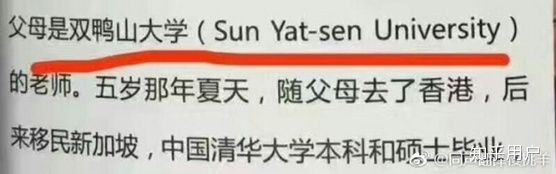

# 双鸭山大学的来历
最近，中大多了一个外号，双鸭山大学。身在广州，而不在双鸭山的中山大学外号为什么会是双鸭山大学呢？其实一切源于微博上的一张截图。

中山大学的英文译名为Sun Yat-sen University，也译为孙逸仙大学。而Sun Yat-sen音译极像“双鸭山”，因而中大就这样误打误撞的多了一个外号。所以，“双鸭山大学”不在双鸭山，而是我们优秀的中山大学。

[博客链接](https://blog.csdn.net/gabriellawu/article/details/83094121).