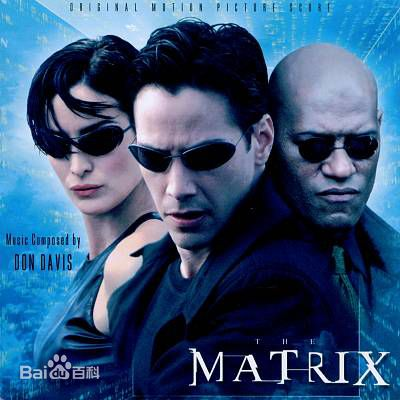

# IT相关的电影
## **黑客帝国**
《黑客帝国》是由华纳兄弟公司发行的系列动作片，该片由沃卓斯基兄弟执导，基努·里维斯、凯莉·安妮·莫斯、劳伦斯·菲什伯恩等主演。影片共三部，为《黑客帝国》、《黑客帝国2：重装上阵》、《黑客帝国3：矩阵革命》，分别于1999年3月31日、2003年5月15日、2003年11月5日在美国上映。
影片讲述了一名年轻的网络黑客尼奥发现看似正常的现实世界实际上是由一个名为“矩阵”的计算机人工智能系统控制的，尼奥在一名神秘女郎崔妮蒂的引导下见到了黑客组织的首领墨菲斯，三人走上了抗争矩阵征途的故事。

## 《黑客帝国》

在矩阵中生活的一名年轻的网络黑客尼奥（基努·里维斯饰）发现，看似正常的现实世界实际上似乎被某种力量控制着，尼奥便在网络上调查此事。而在现实中生活的人类反抗组织的船长墨菲斯（劳伦斯·菲什伯恩饰）， 也一直在矩阵中寻找传说的救世主，就这样在人类反抗组织成员崔妮蒂（凯莉·安·摩丝饰）的指引下，两人见面了，尼奥也在墨菲斯的指引下，回到了真正的现实中，逃离了矩阵，这才了解到，原来他一直活在虚拟世界当中。

## 《黑客帝国2：重装上阵》

实际上，整个《重装上阵》是尼奥探寻自己使命背后真相的过程，他要为自己的行动寻找一个可以接受的理由。在上集打败史密斯（雨果·维文饰）、救出墨菲斯之后，尼奥随同亲密爱人崔妮蒂和其他战友一起，乘坐Nebuchadnezzar号飞船返回地球上最后一个人类据点——锡安基地。在那里，他们和其他自由战士们聚集到了一起。就在这时，母体系统决定“先下手为强”，派遣了为数250000的电子乌贼大军，开始进攻锡安基地，微弱的基地防守力量根本不足以对抗如此强大的机甲兵团，看来人类最后的香火也岌岌可危。可是，“母体取经”的道路注定是凶险多端的：在寻找母体系统内唯一知道系统弱点的“制钥者”的过程中，尼奥、墨菲斯和崔妮蒂遇到了前所未有的困难

## 《黑客帝国3：矩阵革命》

在《黑客帝国》系列电影最后一集中，延续上集《黑客帝国2：重装上阵》的故事，并揭晓机器与人类的最终命运。面对如潮的电子乌贼，人类城市危在旦夕，墨菲斯和崔妮蒂等欲与入侵者决一死战。此时，“救世主”尼奥的身体和思想却意外分离，后者再度陷入到“母体”中。墨菲斯和崔妮蒂也不得不回到“母体”和守护天使一起寻找他。
最后，在和机器的谈判中，机器答应为了人类和机器的共同利益，尼奥去消灭史密斯，而机器不再摧毁锡安。人类迎来新的和平。

##  《代码 the code》
就是用代码开发出一个操作系统的故事，具体讲就是芬兰大名鼎鼎的L系统产生发展的故事.

## 《乔布斯传》
顾名思义，讲的就是苹果的创始人史蒂夫乔布斯的故事。(百度里面信息好像不多)

