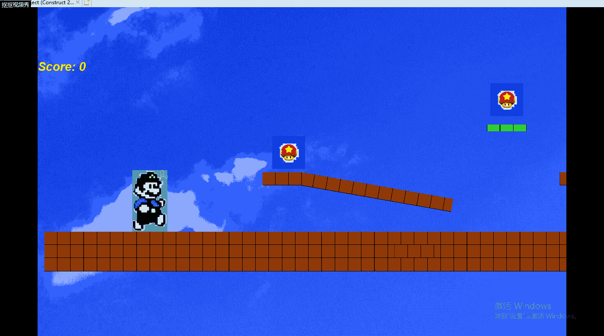

## 吃蘑菇的管道工
楔子(Setting)：灵感来源于超级玛丽，其实是一个特别爱吃蘑菇的管道工在看到一堆蘑菇隐藏在迷宫中开始了超级跑酷的故事。  
玩法(Gameplay)：通过键盘的上和右键控制player向上跳和前进。然后要尽量去吃蘑菇，蘑菇会在高处或者地上，通过在空中的台阶可以吃到蘑菇。吃到一个蘑菇会加一分。  
人设与道具（Game Sprites）：  
player：一个可以跳来跳去的水管工。  
treasure：蘑菇。这是加分的唯一办法。
## CRCs
|ObjectName|Attributes|Collaborator|
|-|-|-|
水管工|玩家|蘑菇、各种跳板

|ObjectName|Attributes|Collaborator|
|-|-|-|
蘑菇|加分利器|水管工

|ObjectName|Attributes|Collaborator|
|-|-|-|
地板跳板|前进道路、辅助获得蘑菇|蘑菇、水管工
