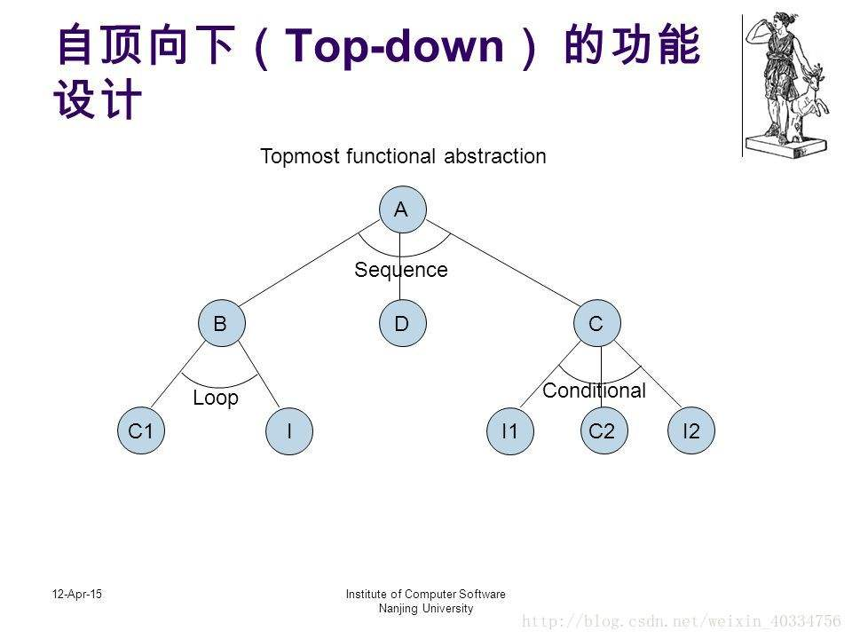

[博客链接](https://blog.csdn.net/gabriellawu/article/details/84102)
## 自顶向下，逐步求精（Top-down design）
自顶向下（top-down）的分析算法通过在最左推导中描述出各个步骤来分析记号串输入。将大型的数字电路设计分割成大小不一的小模块来实现特定的功能，最后通过由顶层模块调用子模块来实现整体功能，这就是Top-Down的设计思想。（引自百度百科）

自顶向下，是将一个大问题细分，分为一个个可以解决的小问题后再解决这些问题，从而解决问题。

以洗衣机工作为例
先将问题分为
注水>>浸泡>>清洗>>排水>>停机五个大问题
再细节的解决每一个部分的程序设计
```
WHILE（volume<setted）
    water_in_switch(open);
    get_water_volume();
END WHILE
//注水
water_in_switch(close);
WHILE(time<setted)
    浸泡；
    time_counter();
END WHILE
//浸泡
WHILE(time<setted)
    motor_run(left);
    motor_run(right);
    time_counter();
END WHILE
//清洗
WHILE(volume>0)
    water_out_switch(open);
    get_water_volume();
END WHILE
//排水
halt(returncode);
//停机
```