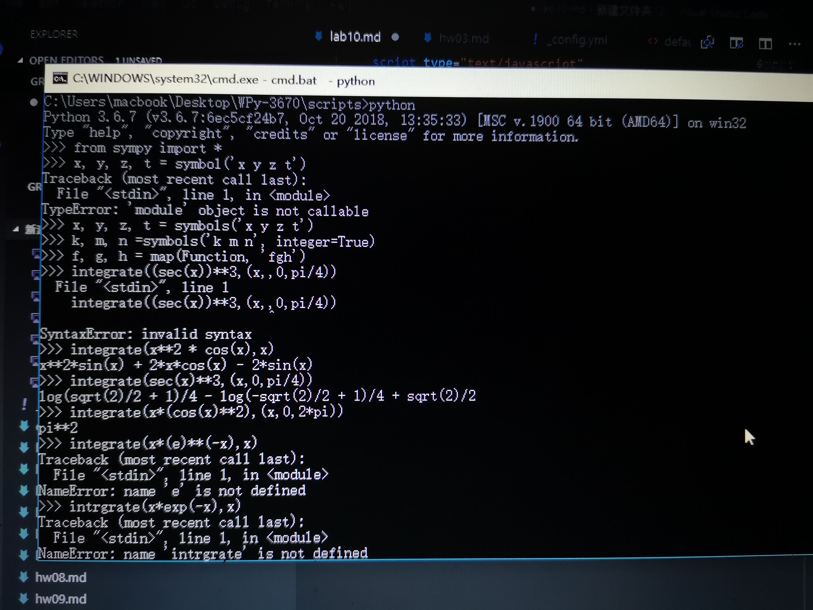
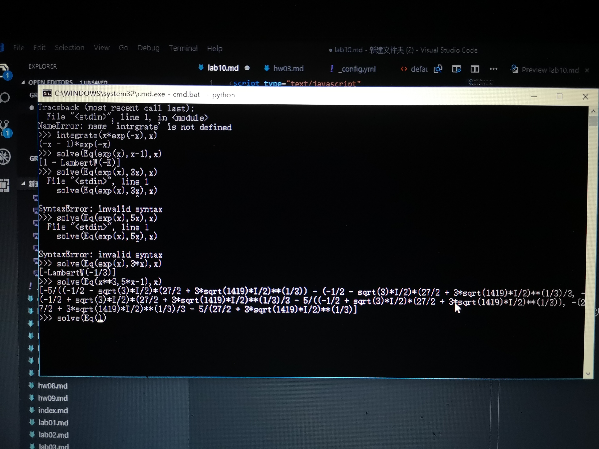

作为一名医学生，我们是不学线代的。
所以，我只能做一些高数题。
我们同样也没有学泰勒展开。
所以，我就解一下方程，求一下积分吧.  

$$\int_{0}^{\pi*2}x(cosx)^2dx={\pi}^2$$

$$\int x(e)^{-x}dx=(-x-1)e^{-x}$$
解方程

$$ e^{x}=3x$$
解得

$$x=-lamberw(-1/3)$$
还解了

$$x^{3}=5x-1$$
但因为答案太复杂，所以在下面的图里。

